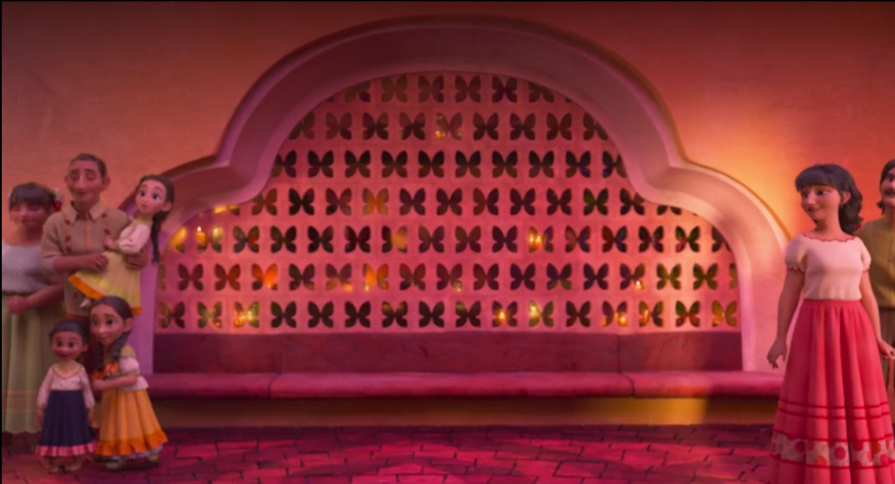

At the end of [Encanto](https://en.wikipedia.org/wiki/Encanto_(film)), I spotted one of the butterfly bricks was placed upside-down

No idea if it means anything, and in a later frame it's the right way up again. Does anyone know why?

Yeah, this is a random and boring post. The real reason is I've just migrated the whole site from wordpress to [hugo](https://gohugo.io/) and I wanted to add a post to test it out...