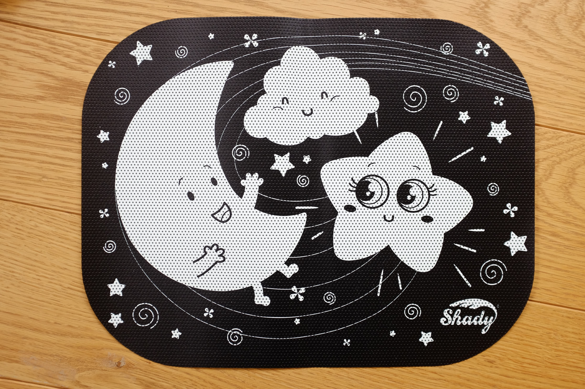
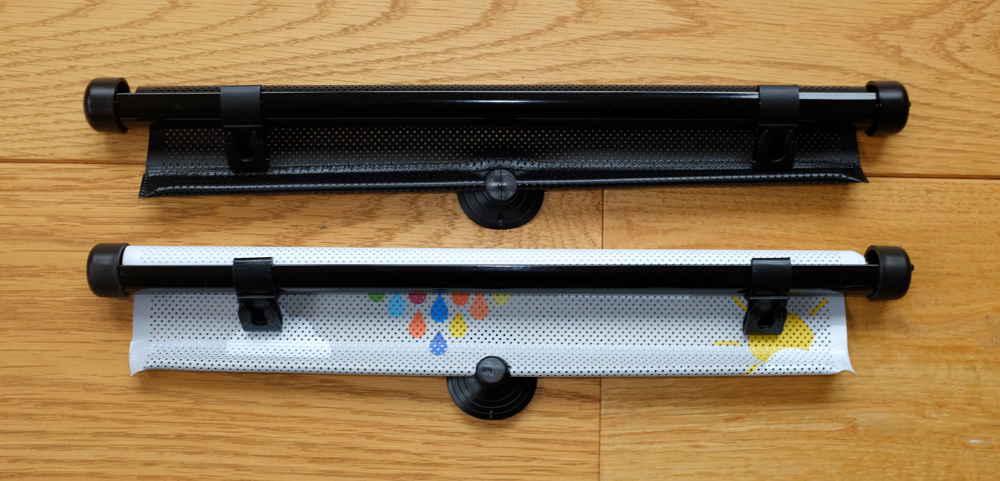
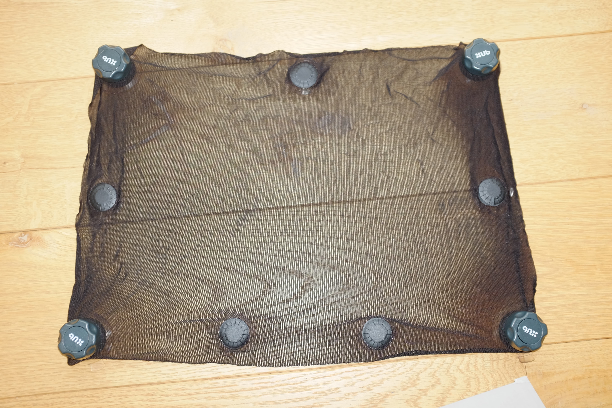
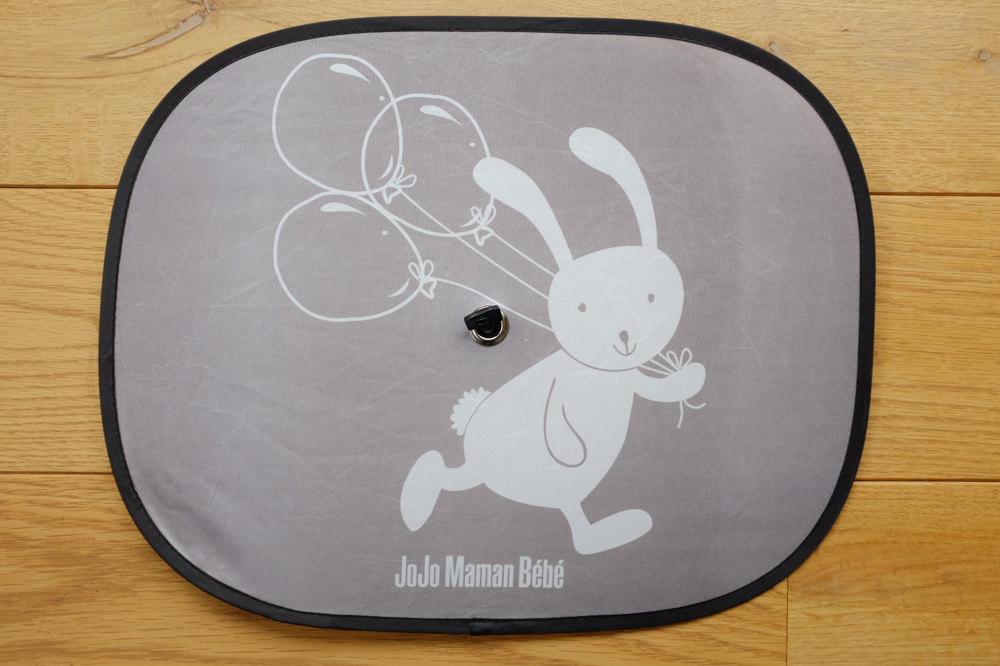
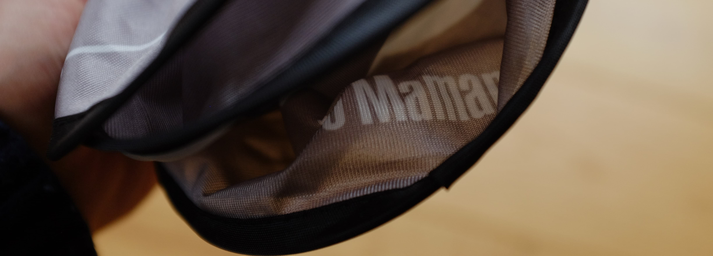
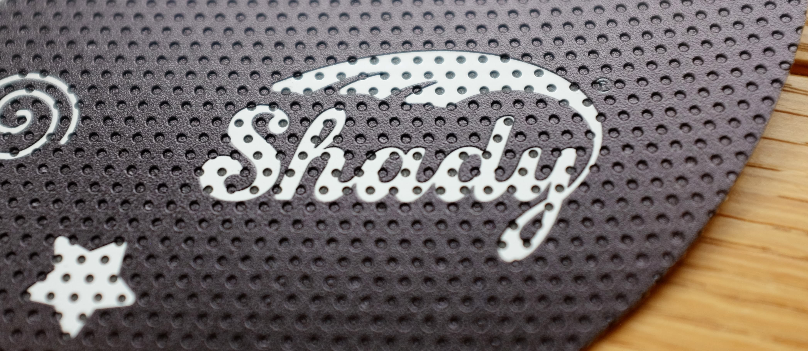

# Hands-on review for the ultimate car sunshade in 2022

Are you looking for _the right sunshade_ for your car? Well, let's get something out of the way...

### _DON'T TRUST A WORD I'M SAYING_

Seriously, you shouldn't trust me, I am so biased and conflicted that everything below should be treated like an advert. I'm freinds with a product designer that made one of the products this blog post is about. I've not said which one it is, but the picture above shows one of the products already unrolled and looking awesome so that's probably a good bet that this isn't a fair comparison off the bat. So yeah, this blog post is nowhere near impartial. Feel free to go back to your Google search for someone more neutral like I'm sure all the other reviewers are.

Having said all that, I will do my best to be honest in this comparison, I'm just saying you shouldn't believe a word of it.

### Design styles

Right, well first off, there are various styles of sunshade design that share common features. Thinking about which features you care about can save you some time.

| **Style** | **Description** | [**Openable windows?**](#openable-windows) | [**Kid-proof**](#kid-proof) | [**Simple**](#simple) | [**Re-positionable**](#re-positionable) | [**Clean**](#clean) | [**Secure**](#secure) |
|---|---|---|---|---|---|---|---|
| **Adhesive** | Vinyl that sticks to the glass, and thin enough to stay on glass inside the door | ✅ | ✅ | ✅ | once or twice | ✅ | ✅ |
| **Static cling** | Relies on static to cling to window.  | ❌ | ❌ | ✅ | ✅ | ✅ | ❌ |
| **Roller** | Roller sticks to window, blind pulls down | partial | ❌ | fair | ✅ | ✅ | ✅ |
| **Suckers** | Net held to glass with sucker(s) | ❌ | ❌ | ✅ | ✅ | ✅ | ✅ |
| **Net** | Net sock that stretches over door | ✅ | ❌ | fair | ✅ | ❌ | ❌ |

### Openable windows

Having spent a few years with a sucker sunshade, I found myself constantly getting annoyed when I couldn't open the window. Being able to open it when you randomly find yourself driving past llamas is pretty liberating :)

Personally, of all the features I care about, this is the most important one.



### Kid-proof

Are the shades easily ripped off by cheeky toddlers (/little monsters)? Luckily, neither of my kids ever did this so it's not a priority for me. Although I know a fair few kids that do like to destroy anything in arm's reach. Something to consider at least, especially if you still have a newborn etc.

### Simple

How simple is the design? Is it fiddly to operate? Does it have moving parts that are liable to break? Does it look good on the inside _and_ the outside?

### Re-positionable

Can the sunshade be easily uninstalled and reinstalled?

### Clean

Does the sunshade make cleaning the car more diffficult? Does the sunshade become a thing that itself needs cleaning?

### Secure

Will it stay attached to the window until you take it off? Does it just drop off when you start driving down the motorway on a hot sunny day? (not fun)

Worse still, will it go flying out the window when you accidentally open the window? 😅

## Product Summary

These are the shades we bought for this review. We tried to find the most popular products across the various design types.

| **Name** | **Price** | **Type** | [**Openable windows?**](#openable-windows) | [**Kid-proof**](#kid-proof) | [**Simple**](#simple) | [**Re-positionable**](#re-positionable) | [**Clean**](#clean) | [**Secure**](#secure) |
|---|---|---|---|---|---|---|---|---|
| **[Shady](https://www.printelligently.com/shady)** | £14.99 | [Adhesive](#design-styles) | ✅ | ✅ | ✅ | once or twice ? | ✅ | ✅ |
| **[Kinder Fluff](https://smile.amazon.co.uk/Possible-Protection-2-Transparent-Semi-Transparent-Sunshades/dp/B00ZOKJVAG)** | £14.86* | [Static cling](#design-styles) | ❌ | ❌ | ❌ | ✅ | ✅ | ❌ |
| **[Enovoe](https://smile.amazon.co.uk/Car-Sun-Shades-Kids-Pack/dp/B00KL3ALGO)** | £9.97 | [Static cling](#design-styles) | ❌ | ❌ | ✅ | ✅ | ✅ | ❌ |
| **[Halfords](https://www.halfords.com/baby-and-child/car-seat-travel-accessories/sunshades-blinds/halfords-roller-sunshades-cloud-x2-264579.html)** | £10.80 | [Roller](#design-styles) | Partial | ❌ | fair | ✅ | ✅ | ✅ |
| **[JellyBaBaBaby](https://smile.amazon.co.uk/JELLYBABABABY-Car-Window-Shades-Universal/dp/B01HLA4LWO)** | £14.99 | [Net](#design-styles) | ✅ | ❌ | fair | ✅ | ❌ | ❌ |
| **[Brica - Munchkin](https://smile.amazon.co.uk/Munchkin-Provides-Maximum-Protection-Premium/dp/B07BZVJPDZ/)** | £15.00 | [Roller](#design-styles) | Partial | ❌ | fair | ✅ | ✅ | ✅ |
| **[Chicco](https://smile.amazon.co.uk/Chicco-Roller-Shade-pack-2/dp/B00MAG9P4Y)** | £12.00 | [Roller](#design-styles) | Partial | ❌ | fair | ✅ | ✅ | ✅ |
| **UPPAbaby** | £15.59† | [Suckers](#design-styles) | ❌ | ❌ | ✅ | ✅ | ✅ | ✅ |
| **[JoJo Maman Bebe](https://www.jojomamanbebe.co.uk/2pack-popup-car-sunshades-e7552.html)** | £7.00 | [Suckers](#design-styles) | ❌ | ❌ | ✅ | ✅ | ✅ | ✅ |

*\* Pack of 4 shades*

*† Pack of 1 shade(!)*

### Shady

£14.99 - [Shady](https://www.printelligently.com/shady)

This adhesive vinyl sunshade sticks directly to the glass like a sticker. The material is a thick plastic material that feels tough and durable, but is still thin enough to allow the window to open. The material itself is actually opaque but has perforations which allows some light through. The effect is that when inside the car you can still see outside but 86% of the UV rays have been blocked.

### Chicco / Halfords

£12 / £10.80 - [Chicco](https://smile.amazon.co.uk/Chicco-Roller-Shade-pack-2/dp/B00MAG9P4Y) / [Halfords](https://www.halfords.com/baby-and-child/car-seat-travel-accessories/sunshades-blinds/halfords-roller-sunshades-cloud-x2-264579.html)

These two shades are clearly from the same factory and just have different designs and packaging.

Identical in operation, they hook onto some provided suckers you stick to the window, then you pull the shade down. They each go back at the press of a button on the top which works well. There's an extra sucker to stick the blind to the glass to stop it flapping about. There's a good chance it just becomes a toy for kids to play with. The idea of this design is that you can roll it up out the way to look out the window which is good if you regularly have adults/older kids in the back of the car.

### UPPAbaby

£15.59 - each (!)

UPPAbaby is a popular brand and have some decent products so I had high expectations for this product. It appears they have attempted to focus on maximum window coverage, or perhaps on strange window shapes? I'm not sure. It should also be commended for being different to most of the others. Unfortunately, that's where the praise ends. I found this to be the most fiddly and generaly ugly design under review. I generally felt worried I would rip the material, but I was quite rough with it and it survived so maybe that's unfair. It's the only product that contained a single shade. This makes this option the most expensive by far.

### JoJo Maman Bébé

£7 (+£3.95 delivery if not collecting from store)

JoJo Maman Bébé is another popular brand known for high quality clothing. This shade is a simple popup design with a single-sucker in the middle. You can't open the windows, but at the price, it's a decent product.

# Conclusion

### Best overall - [Shady](https://www.printelligently.com/shady)

£14.99 - [Shady](https://www.printelligently.com/shady)

The Shady has the simplest design and ticks the most boxes. The bold design looks great and get's the thumbs up from my kids. From the outside of the car it's almost invisible. The deal-breaker for me was being able to open the windows. Game-changer!

### Best budget - [JoJo Maman Bébé](https://www.jojomamanbebe.co.uk/2pack-popup-car-sunshades-e7552.html)

£7 (£3.95 delivery) - [JoJo](https://www.jojomamanbebe.co.uk/2pack-popup-car-sunshades-e7552.html)

If you want something cheap and simple that is still well-made, this was the best we found.

