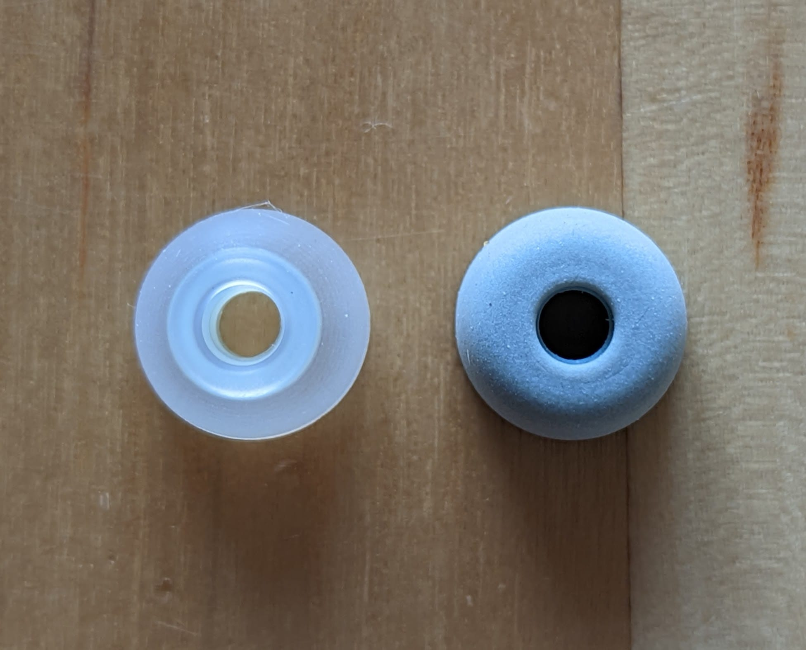
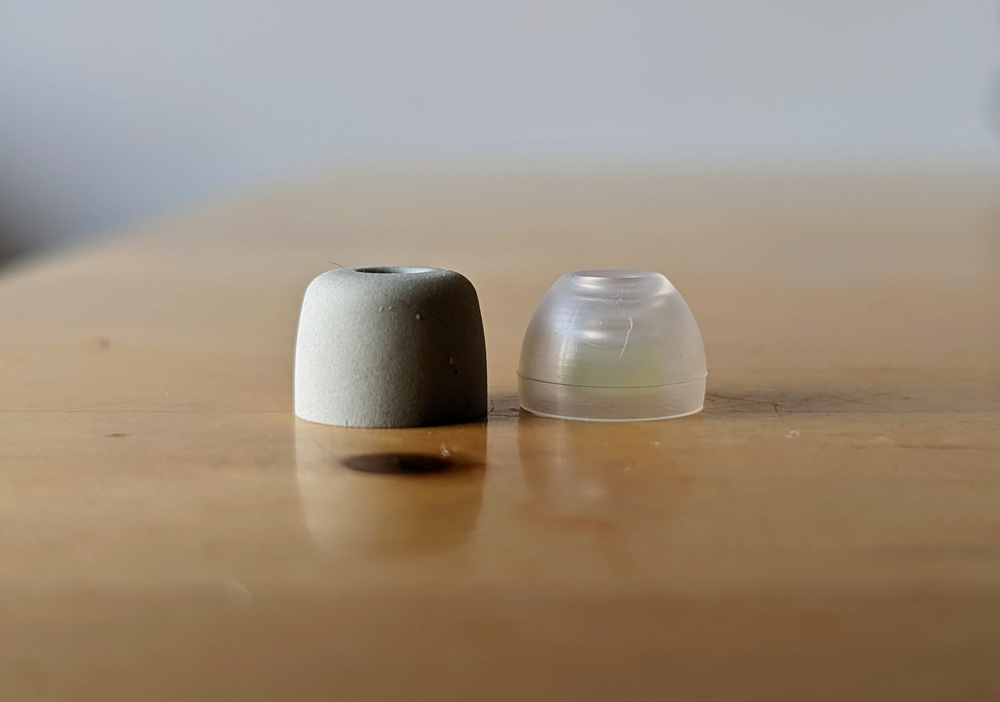
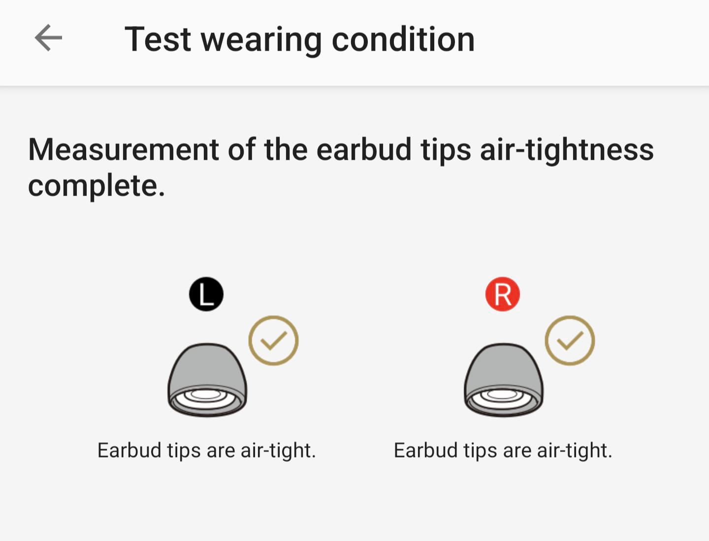

# These Sony Earbuds, sound great, but are awkward to fit

I was very disappointed when these earbuds. Most online reviewers rave about the comfort. They sound great, but none of the supplied tips seemed to fit me properly. It took me 5 minutes of faffing about squeezing and rotating them whenever I wanted to wear them. Not the quick and convenient earbuds I was hoping for. If I couldn't get better tips, I was going to have to send them back...

## Testing the [Spinfit CP360](https://smile.amazon.co.uk/gp/product/B07PJNHM3Z) tips

These tips are silicone and just seem to grip my ear canals better. I don't need to squeeze them and wait to expand or anything, I just jam them in and they grip pretty much straight away.

Size M have the same diameter as the Sony tips...

...but a different profile:

Within a minute of opening the packet, I have these in my ears and passing the in-app airtightness test. Huzzah.

They're [described on Amazon](https://smile.amazon.co.uk/gp/product/B07PJNHM3Z) confusingly as "3.6mm True Wireless" for some reason.

### Bonus "tip"

Today I discovered that if you cover the left earbud, it temporarily mutes what you're listening to. Not sure that's better than just tapping pause, but it's interesting at least.