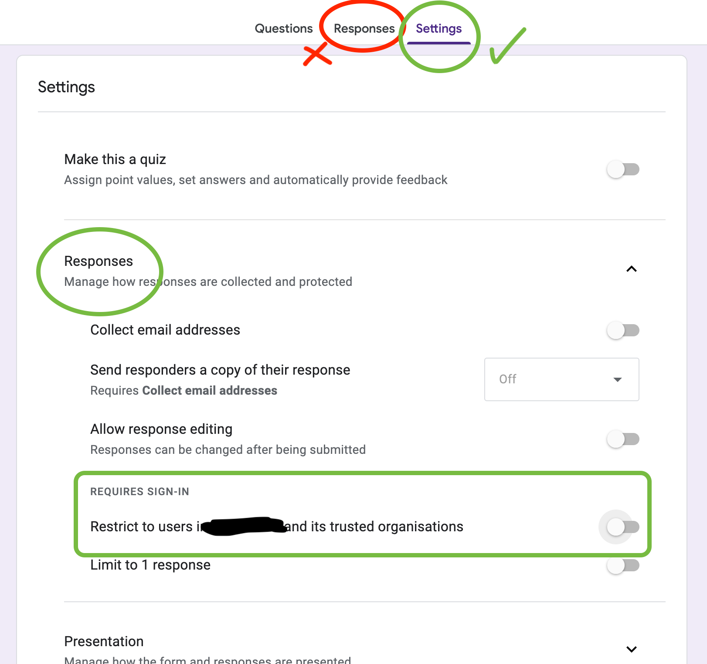

# "This form can only be viewed by users in the owner's organisation"

Have you created a Google Form but was unable to share it outside your organisation? A whole bunch of help online will tell you there's an option right under the "Responses".

What they really mean, is that it's under `Settings -> Responses`

I hope you didn't tear out as much hair as me.